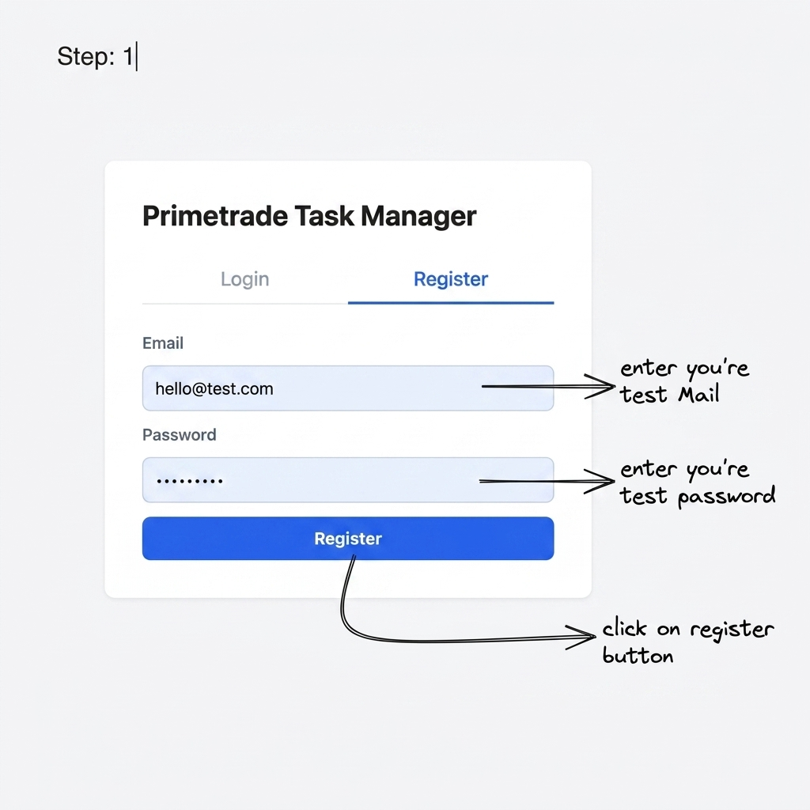
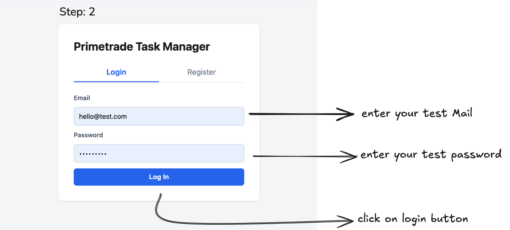
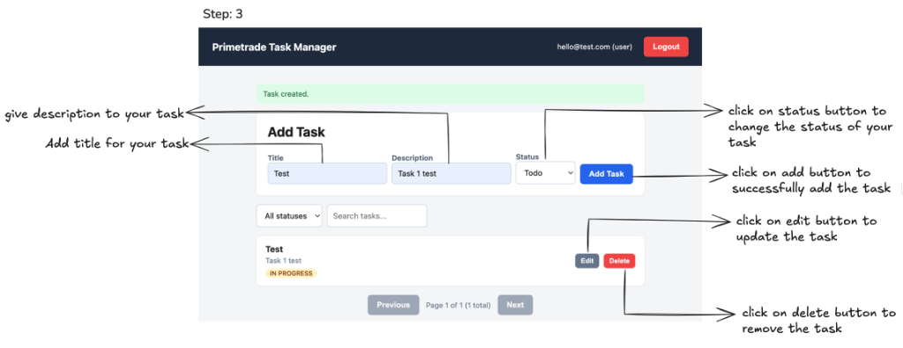

# Primetrade Backend — Scalable REST API with JWT Auth, RBAC & Task Management

A full-stack task management application built for the **Primetrade.ai Backend Developer (Intern) assignment**.

It includes a **FastAPI + PostgreSQL** backend with **JWT authentication**, **role-based access control (RBAC)**, and **Task CRUD APIs**, along with a **Vanilla JavaScript frontend** to demonstrate the complete register → login → task management flow.

---

## Live Deployment

### Frontend
**https://primeai-frontend.onrender.com/**

### Backend API
**https://primeai-backendtest.onrender.com**

### Swagger Docs
**https://primeai-backendtest.onrender.com/docs**

### ReDoc
**https://primeai-backendtest.onrender.com/redoc**

### Health Check
**https://primeai-backendtest.onrender.com/health**

---

# Table of Contents

- [Overview](#overview)
- [Features](#features)
- [Tech Stack](#tech-stack)
- [Live Deployment](#live-deployment)
- [Project Structure](#project-structure)
- [Local Setup & Run](#local-setup--run)
- [Authentication & RBAC](#authentication--rbac)
- [API Summary](#api-summary)
- [Database Schema](#database-schema)
- [Architecture](#architecture)
- [Web App Usage](#web-app-usage)
- [Testing](#testing)
- [Deployment](#deployment-render--neon)
- [Scalability Note](#scalability-note)
- [Important Notes](#important-notes)

---

# Overview

This project is a **secure, scalable REST API** with a simple web frontend. It was built as a greenfield implementation for the Primetrade.ai assignment.

The application supports:

- User registration and login
- JWT-based authentication
- Role-based access control with **user** and **admin** roles
- Full CRUD operations for a secondary entity (**Tasks**)
- Versioned REST API (`/api/v1`)
- Validation, error handling, and Swagger documentation
- A lightweight frontend to test the system end-to-end

---

# Features

## Authentication
- Register a new account
- Login with email + password
- JWT access token generation
- Protected routes using bearer authentication
- Current-user profile endpoint

## Role-Based Access Control (RBAC)
- **User** role → can manage only their own tasks
- **Admin** role → can view all users and access all tasks

## Task Management
- Create a task
- View tasks
- Update a task
- Delete a task
- Filter, paginate, search, and sort task lists

## Developer Experience
- Auto-generated API docs via Swagger and ReDoc
- Alembic migrations for schema management
- Automated test suite with Pytest
- Production deployment on Render + Neon

---

# Tech Stack

| Layer | Choice |
|---|---|
| Backend framework | FastAPI |
| Database | PostgreSQL |
| Production DB hosting | Neon PostgreSQL |
| ORM / Migrations | SQLAlchemy 2.0 (async) + Alembic |
| Validation | Pydantic v2 |
| Authentication | JWT (`python-jose`) + bcrypt (`passlib`) |
| Frontend | Vanilla JavaScript + HTML + CSS |
| Testing | Pytest + HTTPX + in-memory SQLite |
| Deployment | Render (Web Service + Static Site) |

---

# Project Structure

```text
backend/
  app/
    main.py                  # FastAPI entrypoint, middleware, exception handlers, /health
    core/
      config.py              # environment settings
      security.py            # password hashing + JWT helpers
      logging.py             # request logging
    db/
      base.py                # declarative base
      session.py             # async engine/session + DB connection check
    models/
      user.py                # User model
      task.py                # Task model
    schemas/
      user.py                # request/response schemas
      task.py
      token.py
    crud/
      user.py                # user DB operations
      task.py                # task DB operations
    api/
      deps.py                # auth/session dependencies
      v1/
        auth.py              # register, login, me
        users.py             # admin-only routes
        tasks.py             # task CRUD
        router.py            # API v1 router aggregation
  alembic/                   # migrations
  tests/                     # test suite
  requirements.txt
  Procfile

frontend/
  index.html                 # login / register page
  dashboard.html             # protected task dashboard
  css/
    styles.css
  js/
    api.js                   # API base + fetch wrapper
    auth.js                  # auth flow
    tasks.js                 # task CRUD logic

postman_collection.json
README.md
```

---

# Local Setup & Run

### 1. Prerequisites
- Python 3.11+
- PostgreSQL running locally (or update `DATABASE_URL`)

### 2. Backend

```bash
cd backend
python3 -m venv .venv
source .venv/bin/activate
pip install -r requirements.txt

cp .env.example .env
# edit .env: set DATABASE_URL, JWT_SECRET, ADMIN_EMAIL, etc.

createdb primetrade          # or create the DB via psql
alembic upgrade head         # run migrations

uvicorn app.main:app --reload --port 8001
```

- API base: `http://127.0.0.1:8001/api/v1`
- Swagger UI: `http://127.0.0.1:8001/docs`
- ReDoc: `http://127.0.0.1:8001/redoc`
- Health check: `http://127.0.0.1:8001/health`

### 3. Frontend

```bash
cd frontend
python3 -m http.server 5500
```

Open `http://127.0.0.1:5500/index.html`. Make sure `CORS_ORIGINS` in `backend/.env` includes this origin (it does by default).

---

# Authentication & RBAC

- Register via `POST /api/v1/auth/register` with `{ "email", "password" }`.
- Any user whose email matches `ADMIN_EMAIL` in `.env` is **automatically assigned the `admin` role** on registration — no seed script needed. Default: `admin@example.com`.
- Login via `POST /api/v1/auth/login` (OAuth2 form fields: `username`, `password`) → returns a JWT `access_token`.
- Pass the token as `Authorization: Bearer <token>` on subsequent requests.
- In Swagger (`/docs`), click **Authorize** and log in directly — the docs page handles the OAuth2 password flow for you.

### Ownership Rules

- A **user** can create, view, update, and delete only their **own** tasks.
- An **admin** can view, update, and delete **any** user's tasks, and can list all registered users (`GET /api/v1/users`).
- Any cross-user access attempt by a non-admin returns **403 Forbidden**.
- Accessing a protected route without a valid token returns **401 Unauthorized**.

---

# API Summary

| Method | Path | Auth | Description |
|---|---|---|---|
| GET | `/health` | — | Service health check |
| POST | `/api/v1/auth/register` | — | Register a new user |
| POST | `/api/v1/auth/login` | — | Login, returns JWT |
| GET | `/api/v1/auth/me` | user | Current user profile |
| GET | `/api/v1/users` | admin | List all users |
| POST | `/api/v1/tasks` | user | Create a task |
| GET | `/api/v1/tasks` | user | List tasks (pagination, filter, search, sort) |
| GET | `/api/v1/tasks/{id}` | user | Get a task |
| PUT | `/api/v1/tasks/{id}` | user | Update a task |
| DELETE | `/api/v1/tasks/{id}` | user | Delete a task |

**Task list query params:** `skip`, `limit` (pagination) · `status` (filter: `todo`/`in_progress`/`done`) · `search` (matches title/description) · `sort` (`created_at`, `updated_at`, `title`, `status`).

**Status code contract:** `201` create · `200` read/update · `204` delete · `401` unauthenticated · `403` forbidden · `404` not found · `409` duplicate · `422` validation error.

A **Postman collection** (`postman_collection.json`) is included as a backup to the Swagger docs.

---

# Database Schema

**users** — `id` (PK), `email` (unique, indexed), `hashed_password`, `role` (`user`/`admin`), `created_at`, `updated_at`.

**tasks** — `id` (PK), `title`, `description`, `status` (indexed), `owner_id` (FK → users, indexed, `ON DELETE CASCADE`), `created_at` (indexed), `updated_at`.

Indexes on `email`, `owner_id`, `status`, and `created_at` keep lookups, ownership filtering, status filtering, and recency sorting fast as data grows.

---

# Architecture

```
Frontend (Vanilla JS)
        │  fetch + JWT
        ▼
   FastAPI (app/main.py)
        │
        ▼
   PostgreSQL (SQLAlchemy + Alembic)
```

### Auth Sequence

```
Register:  User → FastAPI → hash password (bcrypt) → store in PostgreSQL
Login:     User → FastAPI → verify password → issue JWT → client stores token
Request:   Client → FastAPI (Authorization: Bearer <JWT>) → decode & validate → handler
```

---

# Web App Usage

Follow these steps to use the frontend application:

### Step 1: Register

- Navigate to the **Register** tab.
- Enter your test email.
- Enter your test password.
- Click on the **Register** button to create a new account.



### Step 2: Login

- Navigate to the **Login** tab.
- Enter your test email.
- Enter your test password.
- Click on the **Log In** button to access the task dashboard.



### Step 3: Task Management

Once logged in, you can manage your tasks:

- **Add a Task:**
  - Add a title for your task.
  - Give a description to your task.
  - Click on the status button to change the status of your task.
  - Click on the **Add Task** button to successfully add the task.
- **Update a Task:** Click on the **Edit** button to update the task.
- **Remove a Task:** Click on the **Delete** button to remove the task.



---

# Testing

```bash
cd backend
source .venv/bin/activate
pytest -v
```

29 tests covering registration, login, RBAC, task CRUD, validation errors, and edge cases (all against an isolated in-memory SQLite DB — no impact on your dev Postgres data).

---

# Deployment (Render + Neon)

Deployed as two Render services from this monorepo — `backend` (FastAPI Web Service) and `frontend` (Static Site) — plus a **Neon PostgreSQL** database.

- `backend/Procfile` runs migrations then starts the API: `alembic upgrade head && uvicorn app.main:app --host 0.0.0.0 --port $PORT`.
- Frontend is served as a static site on Render.
- `app/core/config.py` auto-converts `postgres://`/`postgresql://` `DATABASE_URL` to `postgresql+asyncpg://`.
- Set `CORS_ORIGINS` on the backend service to the frontend's Render domain, and update `API_BASE` in `frontend/js/api.js` to the backend's Render domain.

---

# Scalability Note

- **Stateless JWT auth** means any request can be handled by any backend instance — enables horizontal scaling behind a load balancer with no shared session store.
- **Connection pooling** via SQLAlchemy's async engine avoids per-request connection overhead.
- **Indexed columns** (`email`, `owner_id`, `status`, `created_at`) keep the most common queries performant as row counts grow.
- **API versioning** (`/api/v1`) allows introducing breaking changes in a `/api/v2` without disrupting existing clients.
- **Modular structure** (`api/`, `crud/`, `models/`, `schemas/`) makes it straightforward to add new resource modules without touching existing ones.

---

# Important Notes

- The default admin email is `admin@example.com` — change `ADMIN_EMAIL` in `.env` as needed.
- JWT tokens expire based on `ACCESS_TOKEN_EXPIRE_MINUTES` in your `.env`.
- All passwords are hashed with bcrypt before storage — plaintext passwords are never persisted.
- The test suite uses an in-memory SQLite DB, so running tests has zero impact on your development or production data.